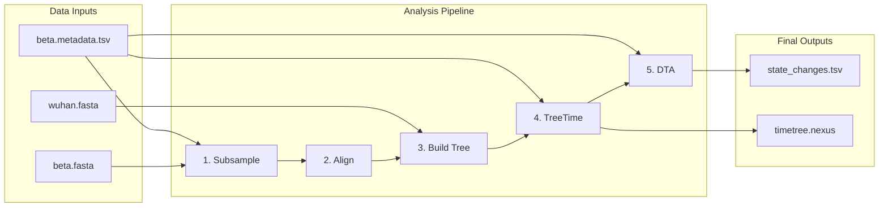

# SARS-CoV-2 Discrete Trait Analysis Pipeline

A Python pipeline for phylogenetic analysis of SARS-CoV-2 sequences to track viral movement patterns between countries.

## Pipeline Overview



## Quick Start

```bash
# 1. Create and activate virtual environment
python3 -m venv venv
source venv/bin/activate

# 2. Install dependencies
pip install -r requirements.txt

# 3. Run pipeline
python run_pipeline.py --seeds 123456 --n-samples 300
```

## Requirements

### Python Dependencies

```bash
pip install biopython pandas baltic
```

Or use the provided requirements file:

```bash
pip install -r requirements.txt
```

### Optional External Tools (Recommended)

For better performance and accuracy, install these tools:

| Tool | Purpose | Installation |
|------|---------|--------------|
| `nextalign` | Sequence alignment | `conda install -c bioconda nextalign` |
| `mafft` | Sequence alignment (fallback) | `conda install -c bioconda mafft` |
| `FastTree` | Phylogenetic tree building | `conda install -c bioconda fasttree` |
| `treetime` | Molecular clock dating | `pip install phylo-treetime` |
| `seqkit` | Fast FASTA processing | `conda install -c bioconda seqkit` |

The pipeline will use pure Python fallbacks if these tools are not available, but results may be slower and less accurate.

## Input Data

### Required Files

| File | Location | Purpose |
|------|----------|---------|
| `beta.fasta` | `sources/data/` | Master FASTA with all sequences |
| `beta.metadata.tsv` | `sources/data/` | Metadata with strain, date, country |
| `wuhan.fasta` | `sources/data/` | Outgroup sequence for tree rooting |
| `reference.fasta` | `modules/nextalign/resources/` | Reference genome for alignment |
| `genemap.gff` | `modules/nextalign/resources/` | Gene annotations |

### Metadata Requirements

The metadata TSV must contain these columns:

- **`strain`** - Must match FASTA headers exactly
- **`date`** - Format: `YYYY-MM-DD`
- **`country`** - Country names for geographic analysis

Example:

```tsv
strain	date	country	...
hCoV-19/Germany/HE-ChVir22557_92/2021	2021-01-13	Germany	...
hCoV-19/Mozambique/INS-K007980/2021	2021-01-06	Mozambique	...
```

## Usage

### Basic Usage

```bash
# Run with default settings (seed=123456, n=300 samples)
python run_pipeline.py

# Run with custom seed
python run_pipeline.py --seeds 123456

# Run with multiple seeds for replicates
python run_pipeline.py --seeds 123456 234567 345678

# Adjust sample size
python run_pipeline.py --seeds 123456 --n-samples 500
```

### Resume from Specific Step

```bash
# Skip completed steps
python run_pipeline.py --seeds 123456 --skip subsample align

# Available steps to skip: subsample, align, tree, treetime, dta
```

### Command Line Options

```
--seeds         Random seeds for reproducible subsampling (default: 123456)
--n-samples     Number of samples per replicate (default: 300)
--skip          Steps to skip (useful for resuming)
--base-dir      Base directory for the pipeline
--output-dir    Custom output directory
```

## Output Structure

Results are organized by seed in `pipeline_results/`:

```
pipeline_results/
└── s123456/
    ├── subsample/
    │   ├── subsample.fasta           # Subsampled sequences
    │   └── subsample_metadata.tsv    # Metadata for subsampled sequences
    ├── align/
    │   └── aligned.fasta             # Aligned sequences
    ├── tree/
    │   ├── ml_tree.treefile          # Maximum likelihood tree
    │   └── aligned.outgroup_added.fasta
    ├── treetime/
    │   ├── timetree.nexus            # Time-calibrated tree
    │   ├── timetree.nwk              # Newick format
    │   └── TreeTime_init/
    │       ├── root_to_tip_regression.pdf
    │       ├── molecular_clock.txt
    │       ├── dates.tsv
    │       └── ...
    └── dta/
        ├── state_changes.tsv         # Viral movement events
        └── mugration/
            ├── annotated_tree.nexus  # Tree with country annotations
            └── GTR.txt               # Transition matrix
```

## Interpreting Results

### state_changes.tsv

Each row represents a viral movement (country-to-country transition):

| Column | Description |
|--------|-------------|
| `EventTime` | Decimal year when movement occurred |
| `Origin` | Source country |
| `Destination` | Destination country |

Example output:

```tsv
EventTime	Origin	Destination
2020.132191	South Africa	Spain
2020.263339	Spain	Austria
2020.296125	Austria	France
```

### Annotated Tree

The `annotated_tree.nexus` contains the phylogenetic tree with country states reconstructed at internal nodes, useful for visualization in tools like FigTree or iTOL.

## Pipeline Steps

### 1. Subsampling

Randomly selects N sequences from the master FASTA based on the provided seed for reproducibility.

### 2. Alignment

Aligns sequences to the reference genome. Uses (in order of preference):
- `nextalign` - Best for SARS-CoV-2
- `mafft` - General purpose aligner
- BioPython padding - Basic fallback

### 3. Tree Building

Constructs a phylogenetic tree. Uses (in order of preference):
- `FastTree` - Fast maximum likelihood
- `IQ-TREE` - More thorough ML analysis
- BioPython NJ - Neighbor-joining fallback

### 4. TreeTime

Performs molecular clock dating to estimate when sequences diverged:
- Clock rate: 0.0008 substitutions/site/year (SARS-CoV-2 default)
- Reroots tree using the oldest sample
- Identifies and removes temporal outliers

### 5. DTA (Discrete Trait Analysis)

Reconstructs ancestral geographic states using TreeTime mugration:
- Infers country at internal tree nodes
- Identifies country-to-country transitions
- Outputs migration events with estimated times

## Configuration

### Key Parameters

| Parameter | Default | Description |
|-----------|---------|-------------|
| `n_samples` | 300 | Sequences per replicate |
| `clock_rate` | 0.0008 | SARS-CoV-2 evolutionary rate |
| `clock_std_dev` | 0.00002 | Clock rate uncertainty |
| `reroot` | "oldest" | Tree rooting method |

### Sample Size Trade-offs

- **~100-200**: Fast, good for testing
- **~300**: Good balance of speed and representation
- **~500+**: Better statistical power but slower

## Troubleshooting

### Common Issues

**"No sequences found matching metadata"**
- Check that FASTA headers match the `strain` column in metadata exactly

**Pipeline is slow**
- Install `seqkit` for faster FASTA processing
- Install `FastTree` for faster tree building
- Reduce `n_samples` for testing

**TreeTime fails**
- Ensure dates are in `YYYY-MM-DD` format
- Check for sequences with missing or ambiguous dates

### Performance Tips

1. Install external tools (`nextalign`, `FastTree`, `seqkit`) for 10-100x speedup
2. Use smaller sample sizes (100-200) for initial testing
3. Run multiple seeds in parallel on different machines

## References

- [TreeTime](https://github.com/neherlab/treetime) - Time-resolved phylogenetics
- [Nextalign](https://github.com/nextstrain/nextclade) - SARS-CoV-2 alignment
- [FastTree](http://www.microbesonline.org/fasttree/) - Approximate ML trees
- [Baltic](https://github.com/evogytis/baltic) - Tree analysis library

## License

This pipeline is provided for research purposes.
